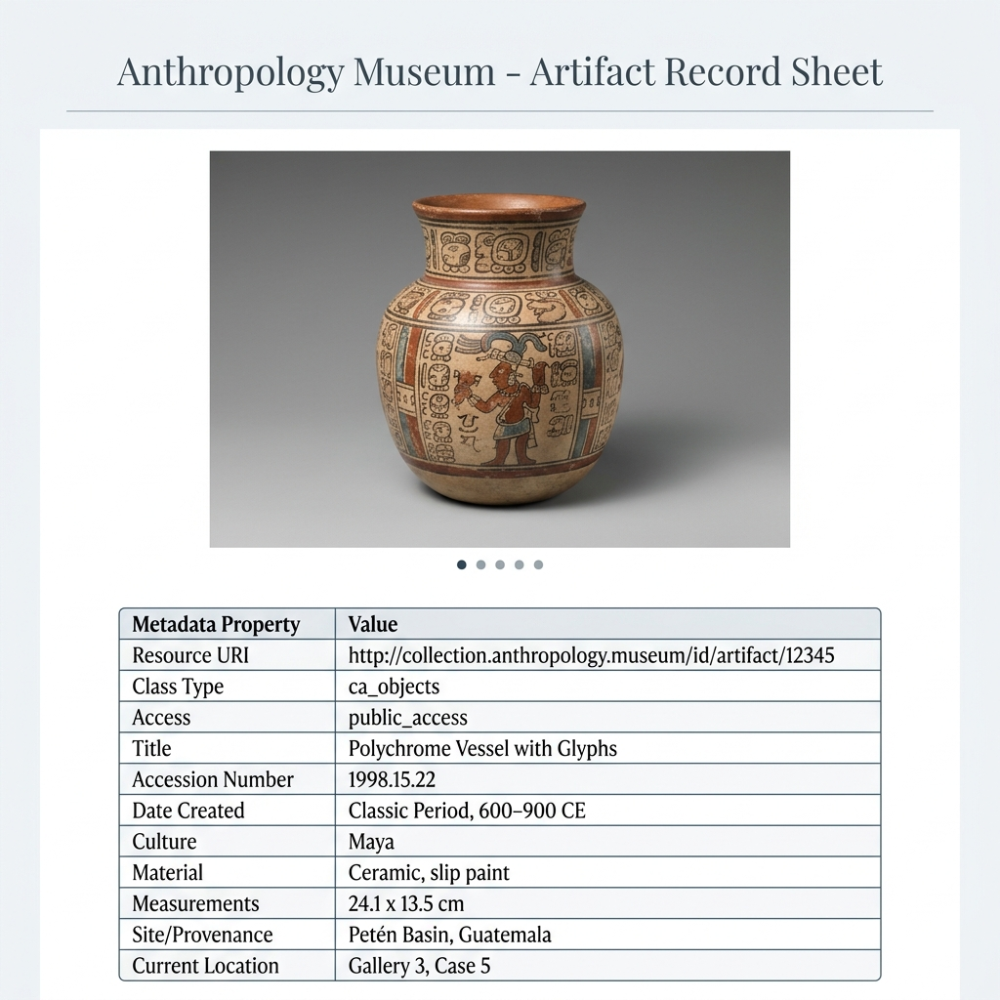

# CollectiveAccess Museum Catalogue RAG Tools

These tools retrieve data from a CollectiveAccess museum catalogue using GraphQL and produce structured HTML and JSON-LD for display on the web and ingestion into a Retrieval-Augmented Generation (RAG) corpus. The outputs provide a foundation for AI-assisted catalogue searching and reporting.

These tools require Python 3.11+. Currently tested with [Google Agent Platform RAG Engine](https://console.cloud.google.com/agent-platform/rag/corpus).

## Tool Summaries

- **`update-table-schema.py`**
  Queries the CollectiveAccess GraphQL API server to retrieve the schema definitions (bundles and attributes) for a given database table (e.g., `ca_objects`), and saves the parsed mapping configuration to `data/{table_name}-schema.json`. The schema configuration includes all metadata elements that are configured for the source CollectiveAccess database, including system fields, user defined fields, and relationships to other tables.

- **`get_items.py`**
  Executes search queries against the CollectiveAccess GraphQL API server, paginates through all matching records, retrieves database bundles specified in the schema file, and saves the consolidated results to `data/{table_name}-items.json`. Fields listed `config/ignore-fields.txt` are excluded from output; these will generally be fields used internally by CollectiveAccess or the institution (such as index rank, object counts, etc.) that should not be included in the RAG corpus.

- **`convert_to_jsonld.py`**
  Iterates through raw search records from `data/{table_name}-items.json`, structures them into JSON-LD documents, downloads associated media files locally, and generates one or both of the following:
  - Interactive, Tachyons CSS-styled HTML representation pages featuring hover definition tooltips and a multi-image slideshow widget (`items/html/`). Each HTML document contains JSON-LD data embedded in a `<script type="application/ld+json">` tag. This allows the same output to be used for static catalogue display on a website and as input for RAG Engine corpus ingestion.
  - Item-specific NDJSON segment records containing structural metadata and media resources (`items/json/`), followed by a consolidated `items.ndjson` file optimized for bulk RAG ingestion into Agent Search data store. Each line is a JSON object. *Not extensively tested.*

- **`generate_json_schema.py`**
  Scans all table schema files in the `data/` subdirectory, compiles a unified list of properties, and generates a valid JSON Schema file saved to `items/schema.json` to define the structure of the RAG ingestion corpus.

---

## Directory Structure under `items`

Below is an example of the minimal set of outputs generated under the `items` directory:

```
items/
├── html/
│   ├── 06cabdda-1918-5fdc-b0b4-160bc36cec75.html
│   ├── f5de7aa4-4dbc-52e1-bb2b-d8495d573d69.html
│   └── 78851_ca_object_representations_media_47_original.jpg
├── json/
│   ├── 06cabdda-1918-5fdc-b0b4-160bc36cec75.json
│   └── f5de7aa4-4dbc-52e1-bb2b-d8495d573d69.json
├── items.ndjson
└── schema.json
```

---

## Ingestible NDJSON Format Example

The `items.ndjson` file is compiled to structure the metadata and resource documents for Vertex AI Search ingestion. Each line is a valid JSON object:

```json
{"id": "06cabdda-1918-5fdc-b0b4-160bc36cec75", "jsonData": "{\"type\": \"ca_objects\", \"title\": \"Slipper\"}", "content": {"mimeType": "text/html", "uri": "gs://anthmuseum-test-4/html/06cabdda-1918-5fdc-b0b4-160bc36cec75.html"}}
{"id": "4de5369a-4d9f-58e9-a27f-664ee32115cb", "jsonData": "{\"represents\": \"f5de7aa4-4dbc-52e1-bb2b-d8495d573d69\"}", "content": {"mimeType": "image/jpeg", "uri": "gs://anthmuseum-test-4/html/78851_ca_object_representations_media_47_original.jpg"}}
```

---

## Rendered HTML Page Mockup with Slideshow

When multiple images are associated with a museum record, an interactive slideshow with navigation thumbnail images is rendered at the top of the Tachyons-styled HTML page. Hovering over table metadata fields displays tooltips with the respective schema description.


